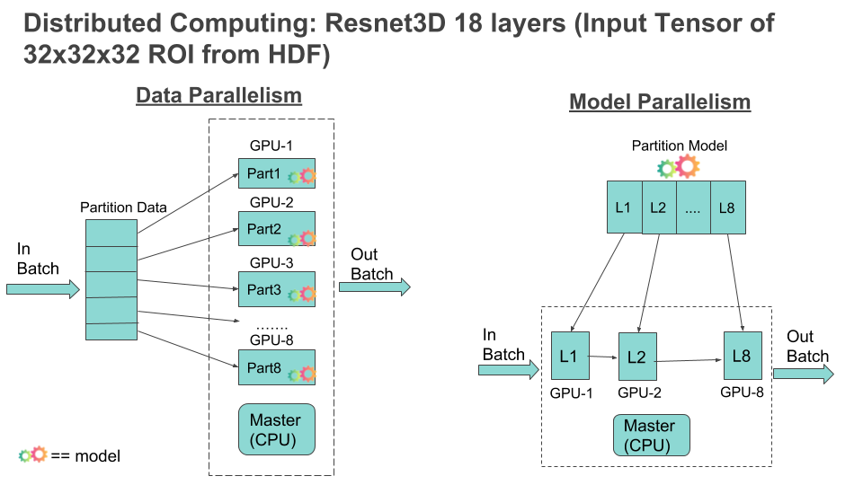
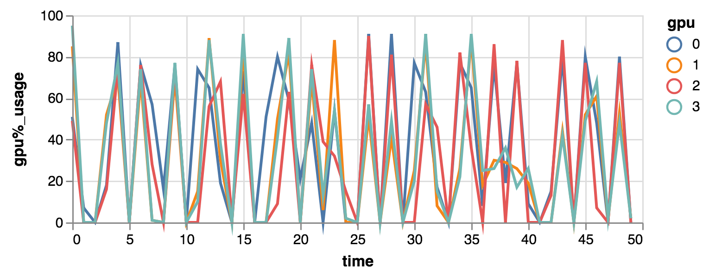
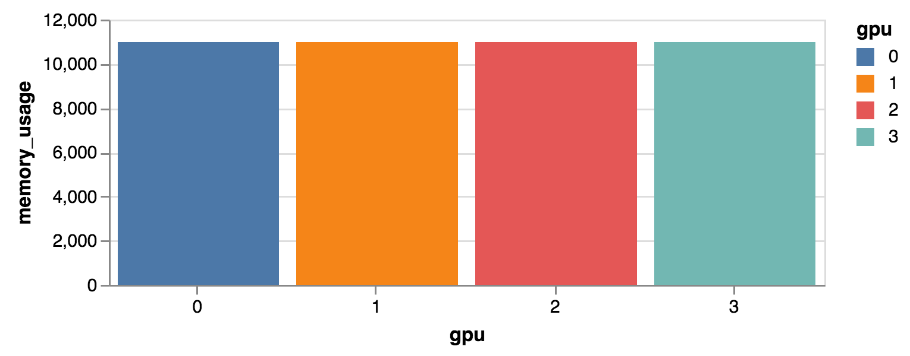

# Scalable Training 3D Medical-Imaging
Develop techniques for [Scalable Training for 3D Medical Imaging](https://docs.google.com/presentation/d/1cILQWzTPs5mmiVa-HMFlNH8ZgPf1_g4ZkDW6KzhaSNo/edit?usp=sharing), entailing Distributing-Computing approach by doing Data & Model Parallelization to expedite training process.

<p align='center'>
  
</p>

## Project Folder Structure:
```
├── src                    
│   ├── model          
│   ├── preprocess         
│   └── notebooks                
└── ...

├── configs                    
│   ├── model.ini          
│   ├── crop_nodules_3d.ini                    
└── ...

├── data                    
│   ├── raw          
│   ├── preprocessed                   
└── ...

├── build                    
│   ├── requirements.txt          
│   ├── environment.yml                   
└── ...
```
## Setup
Clone repository and update python path
```
repo_name=https://github.com/dse-aluthra/Insight_AI_Project
username=dse-aluthra
# Clone master
git clone https://github.com/$username/$repo_name
cd $repo_name

# Clone branch
branch_id=model-parallelize
git clone -b $branch_id  https://github.com/$username/$repo_name

```
Create new development branch and switch onto it
```
branch_name=dev-readme_requisites-20180917
# Name branch, of the form 'dev-feature_name-date_of_creation'}}
git checkout -b $branch_name
```
## Build Environment
 - `pip install -r ./build/requirements.txt`

## Configs
- [crop_nodules_3d.ini](https://github.com/dse-aluthra/Insight_AI_Project/blob/master/configs/crop_nodules_3d.ini)
  - This configuration file specifies folder path to raw data, supporting configuration files and destination, else default values aligned to existing folder structure from git repo will be used

- [model.ini](https://github.com/dse-aluthra/Insight_AI_Project/blob/master/configs/model.ini)
  - This configuration file is used by the model-training scripts. Parameters like BATCH_SIZE, GPUID, path to HDF5 file can be specified (else default values are considered)

## Executing the scripts
- python ./src/preprocess/crop_nodules_3d.py
  - This script will preprocess the raw data and create HDF5 file.

- python ./src/model/modelTrng_No_GPU.py
  - Model training with no GPU usage

- python ./src/model/modelTrng_with_GPU.py
  - Model training with GPU usage

## Analysis & Results
- Following graph illustrates the GPU usage in short window of time, it's obervsed that there is consistent pattern as high and low usage among the 4 GPU's used. The analysis was conducted on 8 GPU instance and only first 4 GPU's are used for processing and analysis. The goal is to uplift the lows/dips and exploit the GPU's processing power by data and model parallelization.

<p align='center'>
  
</p>

- The memory usage and initialization (in 4 GPU's used) remains same and doesn't vary regardless of gpu usage.
<p align='center'>
  
</p>

## Future Steps
- Explore and try Model Parallelization
- Build layer on top of HDF5 to feed multiple threads, as currently HDF5 doesn't support concurrent access   
